# Práctica: Estructuras Lineales "Arboles"

## Datos del Estudiante
- **Nombre:** Edwin Patricio Pintado Reinoso
- **Curso:** Grupo 1

---

## 1. Creacion arboles y insertar datos

**Fecha:** 16/06/2026

**Descripción:** En estas practicas se desarrollo la creacion de clases necesarias para la creacion y buen funcionamiento de arboles, como: 

- Clase Persona: Es el objeto que puede ir dentro de los nodos, aunque por la naturaleza de la clase node puede teener tanto datos primitivos, como objetos.
- Clase Node: Son los contenedores que contienen los datos y se conectan para formar los arboles.
- AddRecursivo: Para la creacion de arboles, haciendo que los valores menores se inserten a la izquierda y los mayores a la derecha. 

---

Imagenes IntTree:

- Persona:

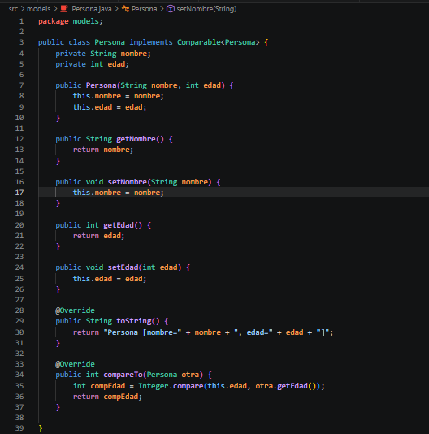

- Node:

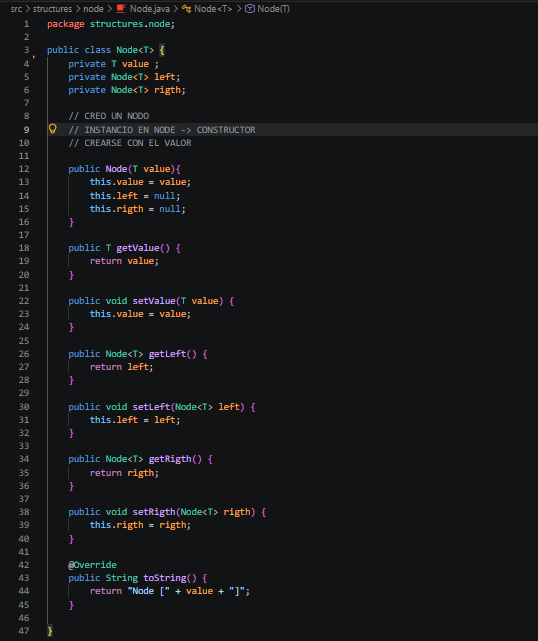

- Metodo

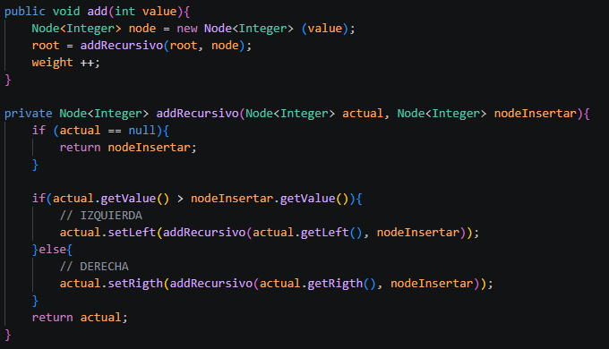

- App

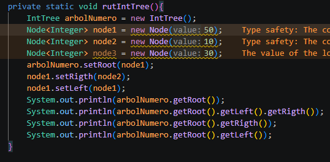

- Ejecución 

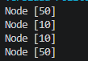

---

## 2. Recorridos y calculo de altura y peso

**Fecha:** 19/06/2026

Ejercicio2: Creacion de metodos para mostrar en consola los datos del arbol de diferentes formas, y calcular su peso y artura.

- inOrden: "IZQUIERDA - RAIZ - DERECHA"
- posOrden: "IZQUIERDA - DERECHA - RAIZ"
- preOrden: "RAIZ - IZQUIERDA - DERECHA"

--- 

- Metodos

- inOrden

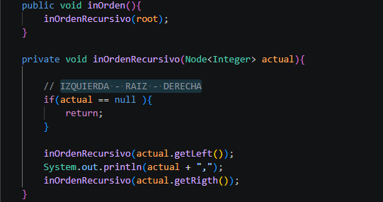

- posOrden

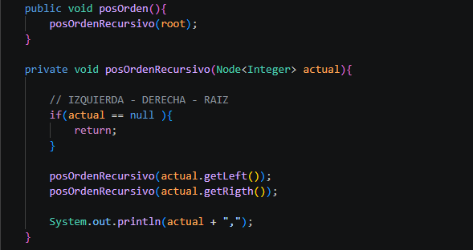

- preOrden

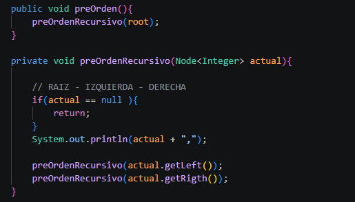

- Peso

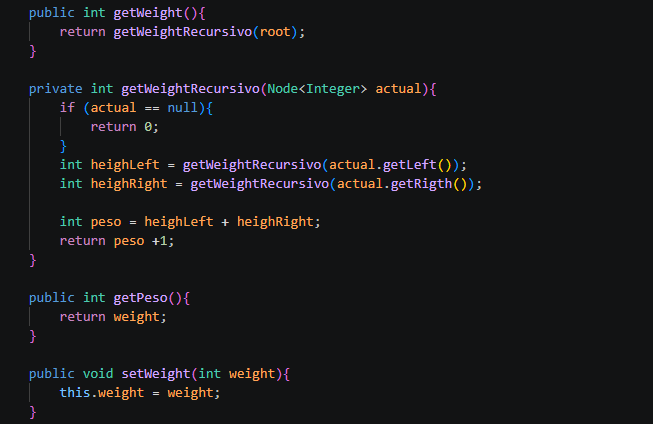

- Estructura de la clase para reducir el peso a O(1)

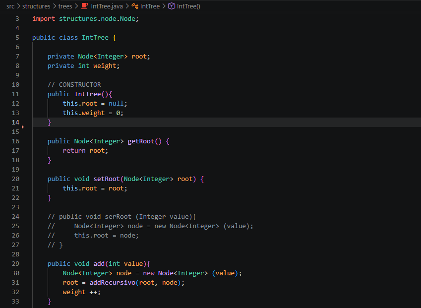

- Altura

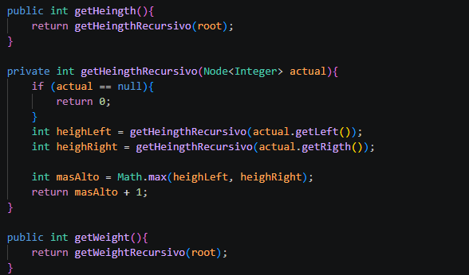

- App

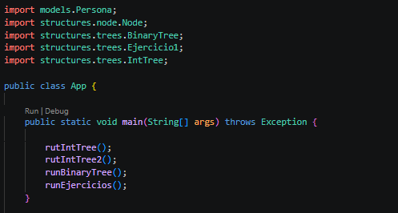

- metodosAPP

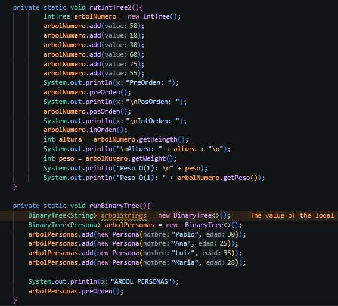

- Ejecucion 

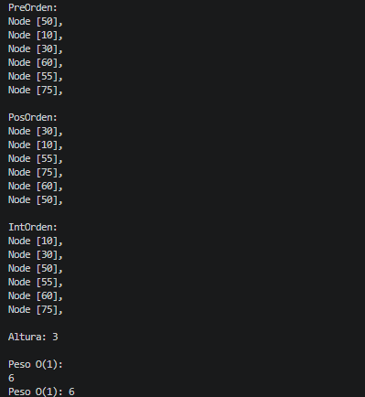

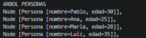